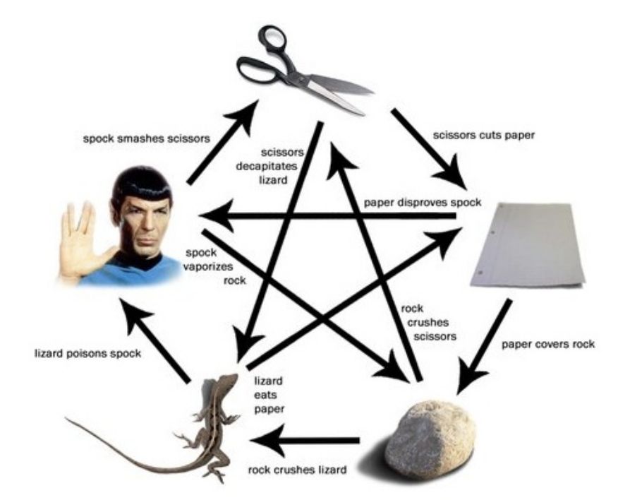

# Rock Paper Scissors Lizard Spock

Rock-paper-scissors-lizard-Spock is an expansion of the classic selection method in a play
of rock-paper-scissors. It operates under the same basic principle but includes two additional weapons: the lizard and the Spock. This way reduces the chances of ending in a
tie. Sam Kass and Karen Bryla invented the game.

## Rules:
• Scissors cut paper
• Paper covers stone
• Stone crushes lizard
• Lizard poisons Spock
• Spock crushes scissors
• Scissors beheads lizard
• Lizard eats paper
• Spock refute paper
• Spock vaporizes stone
• Stone breaks scissors

Created on March 19 13:13:37 2015
